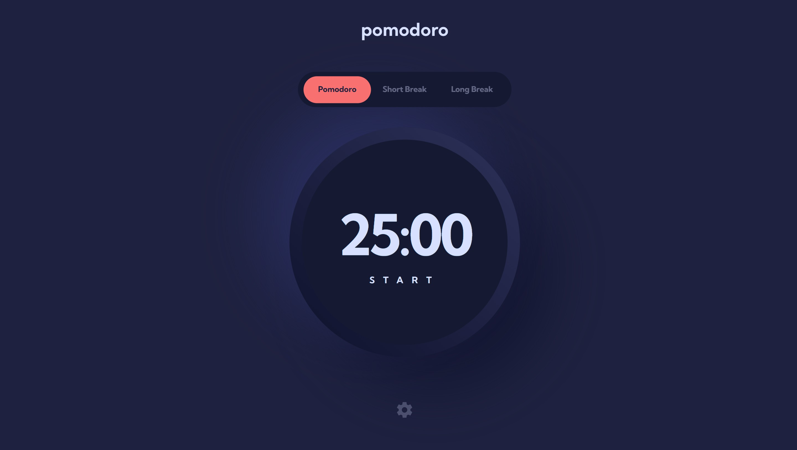

# Frontend Mentor - Pomodoro app solution

This is a solution to the [Pomodoro app challenge on Frontend Mentor](https://www.frontendmentor.io/challenges/pomodoro-app-KBFnycJ6G).

## Overview

### The challenge

Users should be able to:

- Set a pomodoro timer and short & long break timers
- Customize how long each timer runs for
- See a circular progress bar that updates every minute and represents how far through their timer they are
- Customize the appearance of the app with the ability to set preferences for colors and fonts

### Screenshot



## My process

### Built with

- Semantic HTML5 markup + accessible roles (aria-\*, keyboard navigation)
- CSS custom properties
- Flexbox
- Mobile-first workflow
- Vanilla JavaScript (ES6+)
- LocalStorage for user preferences
- SVG circular progress animation
- Responsive design (mobile-first)
- Respect for prefers-reduced-motion

### What I learned

This project pushed me to balance design accuracy with accessibility and maintainability.
A few things I refined along the way:

- Managing state cleanly for multiple timers using a single source of truth.
- Using aria-live and role="timer" to make real-time countdowns accessible.
- Adding adaptive focus outlines that respond to the active theme:

```css
:focus {
  outline: 3px solid color-mix(in srgb, var(--accent-color) 40%, transparent);
  outline-offset: 3px;
}
```

- Persisting and applying theme variables dynamically:

```js
root.style.setProperty("--accent-color", color);
```

### Continued development

I’d like to explore:

- Integrating the Notification API and sound alerts for timer completion.
